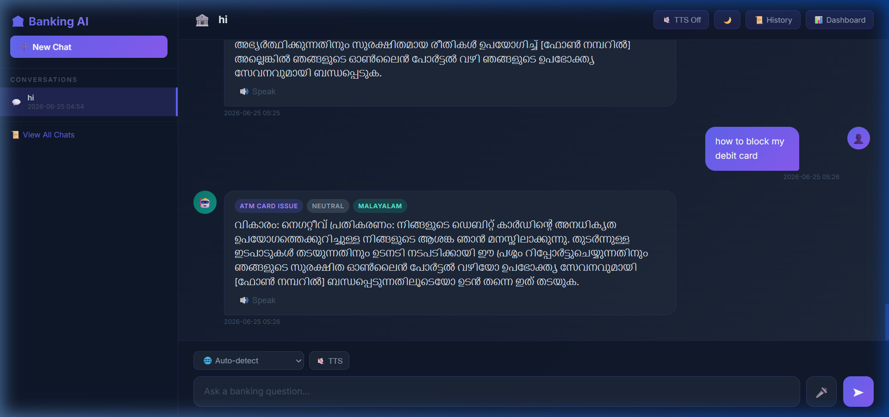
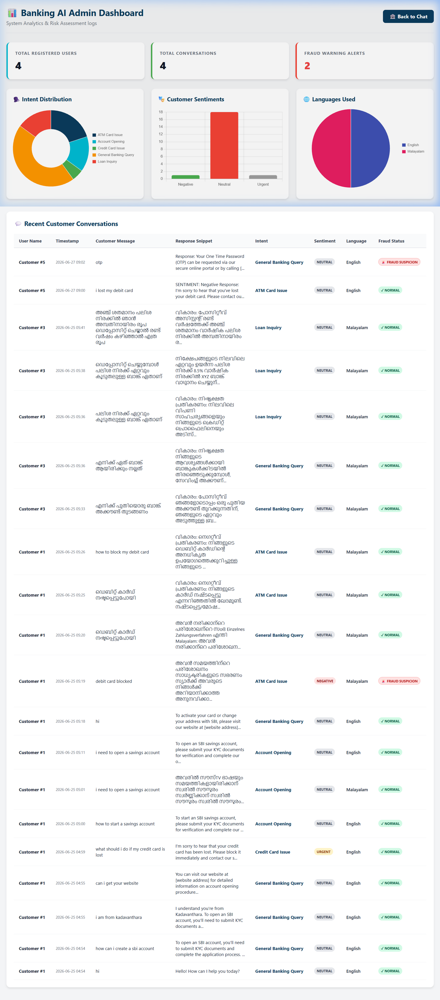
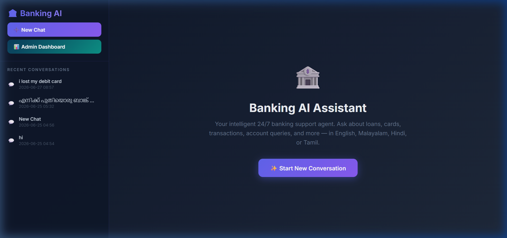
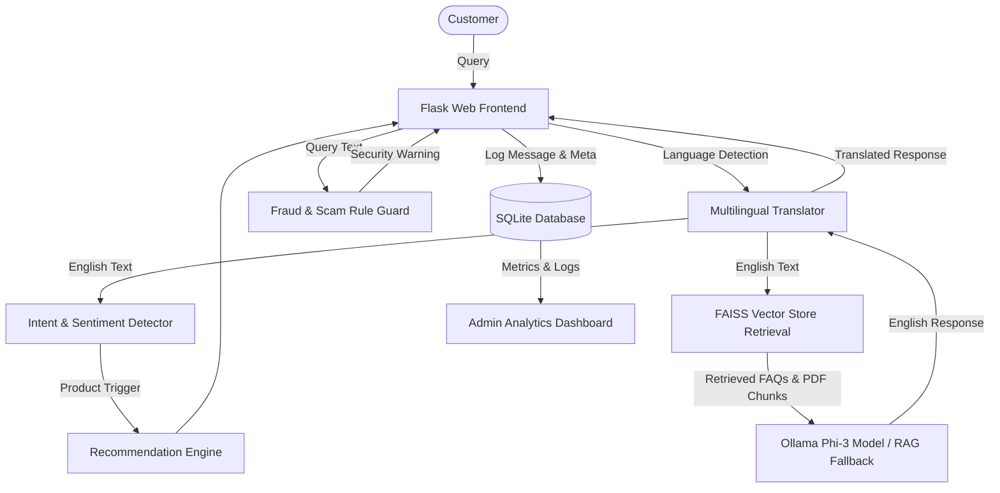

# 🏦 AI Banking Agent

[](https://www.python.org/)
[](https://flask.palletsprojects.com/)
[](https://github.com/facebookresearch/faiss)
[](https://ollama.ai/)
[](LICENSE)

An end-to-end **AI-Powered Intelligent Banking Assistant & Security Risk Management System**. Built with Flask, Sentence Transformers, FAISS vector storage, multi-language translation, intent detection, automated financial product recommendations, fraud/scam detection, and real-time administrative analytics.

---

## 📸 Screenshots Showcase

### 1. Intelligent Chat Interface
Full multi-turn conversation support with intent labeling, sentiment analysis, TTS voice output, and product recommendation cards.


### 2. Admin Analytics Dashboard
System metrics, intent distribution charts, sentiment monitoring, language usage statistics, and live conversation security audit logs.


### 3. Conversation History Manager
Sidebar & dedicated conversation management with quick session selection, instant search, renaming, and history persistence.


---

## 🌟 Key Features

- **🧠 RAG Knowledge Retrieval**: Dual-source FAISS vector database querying structured banking FAQ datasets and PDF policy documents using `all-MiniLM-L6-v2` embeddings.
- **🛡️ Real-Time Fraud & Scam Guard**: Heuristic rule detection for OTP/PIN phishing, fake KYC suspension threats, suspicious payment link scams, and UPI QR code exploitation.
- **📊 Real-Time Admin Dashboard**: Executive telemetry tracking total user queries, intent distributions (doughnut charts), customer sentiment splits (Frustrated, Urgent, Positive, Neutral), and fraud alerts.
- **🌐 Multilingual Support**: Seamless translation between English, Malayalam (മലയാളം), Hindi (हिन्दी), and Tamil (தமிழ்) via Google Translator integration.
- **💡 Smart Product Recommendation Engine**: Context-driven recommendations for credit cards, home loans, high-yield savings accounts, and fixed deposits based on user intent.
- **🗣️ Voice Input & Text-to-Speech**: Speech-to-Text browser input and Web Speech API TTS voice responses.

---

## 🏗️ Architecture Overview



---

## 🛠️ Project Structure

```
BankingAIAgent/
├── app.py                      # Core Flask application server & API routes
├── database.py                 # SQLite database initialization & migrations
├── config.py                   # Model & parameters configuration
├── requirements.txt            # Python dependencies
├── .gitignore                  # Ignored local files (.env, *.db, venv)
├── chatbot/                    # AI Core Modules
│   ├── rag_engine.py           # FAISS vector search, translation & LLM generation
│   ├── fraud_detector.py       # Pattern-based scam & security risk detector
│   ├── intent_detector.py      # Banking query intent classifier
│   ├── recommendation_engine.py# Financial product recommender
│   ├── pdf_vector_store.py     # PDF chunking & vector indexing script
│   └── vector_store.py         # CSV FAQ dataset vector indexing script
├── datasets/                   # Banking datasets & clean CSVs
├── documents/                  # PDF knowledge base sources
├── vectorstore/                # Generated FAISS binary index files
├── templates/                  # Jinja2 HTML Templates
│   ├── chat.html               # Main Chat UI with history sidebar
│   ├── history.html            # Session history overview
│   └── admin_dashboard.html    # Executive analytics dashboard
├── static/                     # CSS stylesheets & assets
└── docs/                       # Project Documentation & Screenshots
    └── screenshots/            # UI Screenshot Gallery
```

---

## 🚀 Quickstart & Setup

### 1. Prerequisites
- **Python 3.10+**
- **Ollama** (Optional for local Phi-3 execution):
  ```powershell
  ollama pull phi3
  ```

### 2. Environment Setup

```powershell
# Clone the repository
git clone https://github.com/ummerulfarook/AI_BANKING_AGENT.git
cd AI_BANKING_AGENT

# Create and activate virtual environment
python -m venv venv
.\venv\Scripts\activate

# Install required packages
pip install -r requirements.txt
```

### 3. Initialize Database & Run

```powershell
# Create SQLite database schema
python database.py

# Start the Flask web application
python app.py
```

Open `http://127.0.0.1:5000` in your web browser.

---

## 🔌 API Endpoints Reference

| Endpoint | Method | Description |
| :--- | :--- | :--- |
| `/` | `GET` | Redirects to Chat History view |
| `/history` | `GET` | Displays all past customer conversation sessions |
| `/new_chat` | `GET` | Creates a new chat session and redirects to chat UI |
| `/chat/<id>` | `GET` | Renders the primary chat interface for conversation `<id>` |
| `/chat/<id>/send` | `POST` | Processes user prompt, executes RAG, fraud check, & returns AI response |
| `/chat/<id>/messages` | `GET` | Retrieves JSON array of messages for conversation `<id>` |
| `/admin` or `/admin/dashboard` | `GET` | Executive dashboard with metrics, Chart.js graphs, and security audit logs |

---

## 📜 License

This project is open-source under the [MIT License](LICENSE).
